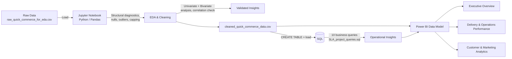

# Quick Commerce SLA, Profitability & Sentiment Analytics
### *An End-to-End Data Analytics Project — Python (EDA) • SQL • Power BI*


> Every quick-commerce app promises "delivery in 10 minutes." This project asks the harder question: **when that promise breaks, who pays for it — and why?** A 13,000-order pipeline traces every breach from the delivery bike back to the store, the peak period, the marketing channel that acquired the customer, and the 1-star review it caused — turning a stack of raw CSVs into a 3-page decision-ready dashboard.

---

## 📌 Table of Contents
- [Problem Statement](#-problem-statement)
- [Project Architecture](#-project-architecture)
- [Tech Stack](#-tech-stack)
- [Dataset](#-dataset)
- [Project Workflow](#-project-workflow)
- [Power BI Dashboard](#-power-bi-dashboard)
- [SQL Analysis](#-sql-analysis)
- [Key Business Insights](#-key-business-insights)
- [Repository Structure](#-repository-structure)
- [How to Reproduce This Project](#-how-to-reproduce-this-project)
- [Results & Recommendations](#-results--recommendations)
- [Future Improvements](#-future-improvements)
- [About Me](#-about-me)

---

## 🎯 Problem Statement

A quick-commerce operator running 85 dark stores wants three questions answered before the next planning cycle:

1. **How badly — and where — is the SLA actually breaking?** Which stores, hours, and peak periods are driving delivery delays, and is that cost falling disproportionately on the customers who spend the most?
2. **Is speed being bought at the expense of profit?** Which stores and time windows are genuinely profitable once delivery cost, packaging, and delay penalties are accounted for — not just high-revenue?
3. **Is the marketing engine and customer experience aligned with operations?** Which acquisition channels actually convert, and does a broken SLA promise show up in ratings, sentiment, and churn risk before it shows up in the P&L?

This project answers all three by building a full analytics pipeline: explore and clean 13,000 raw orders in **Python**, interrogate them with **SQL**, and surface the findings in a 3-page interactive **Power BI** dashboard built for stakeholders who don't have time to read a notebook.

---

## 🏗 Project Architecture



**The flow in plain English:**
`Raw Data → Python EDA & Cleaning → SQL Insight Queries → Power BI Data Model → 3-Page Dashboard`

---

## 🛠 Tech Stack

| Layer | Tool | Purpose |
|---|---|---|
| **Exploration & Cleaning** | Python (Jupyter Notebook) | Structural diagnostics, missing-value handling, outlier capping, feature validation |
| **Python Libraries** | `pandas`, `numpy`, `matplotlib`, `seaborn` | Data wrangling, univariate/bivariate EDA, correlation analysis |
| **Analysis** | SQL | Aggregation, window functions, CTEs for SLA/profitability/marketing insights |
| **BI & Visualization** | Power BI Desktop | Data modeling, DAX measures, 3-page interactive dashboard |

---

## 🗂 Dataset

The raw dataset (`raw_quick_commerce_for_eda.csv`) is a wide, denormalized export joining five real-world entities — **customer feedback, customer profiles, order line items, delivery/order fulfillment, and marketing campaigns** — into **13,000 order-level records across 45 attributes** spanning **July 2024 – June 2025**.

| Metric | Value |
|---|---|
| Total Orders | 13,000 |
| Unique Customers | 3,534 |
| Stores (Dark Stores) | 85 |
| Total Revenue | ₹78.6L |
| Total Profit | ₹14.1L |
| Overall SLA Breach Rate | 12.41% |
| Average Rating | 3.78 / 5 |

**Key attribute groups:**
- 🗣️ **Feedback:** rating, feedback category, sentiment, feedback date
- 👤 **Customer:** area, pincode, registration date, customer segment (Gold / Regular / Inactive), total orders, avg order value
- 📦 **Order & Product:** product ID, quantity, unit price, order total
- 🚚 **Fulfillment:** order date, promised vs. actual delivery time, delivery status, delivery partner, store ID, delay minutes, SLA breach flag
- 📣 **Marketing:** campaign name, target audience, channel, impressions, clicks, conversions, spend, revenue generated, ROAS
- 💰 **Financials (engineered):** profit, profit margin, order hour, day name, peak period

---

## 🔄 Project Workflow

### 1️⃣ Exploration & Cleaning — *Python / Jupyter*
- Loaded the raw export and ran **structural diagnostics** first: checked whether the duplicated ID columns (`customer_id_1/2`, `order_id_1/2`) from the join actually agreed, and confirmed row-level cardinality before trusting the dataset.
- Quantified missingness per column, then **fixed invalid values before imputing** — e.g. out-of-range ratings were set to NaN rather than silently imputed as real values.
- Used **IQR quantification + distribution plots together**, not IQR alone: the numeric fields (`quantity`, `order_total`, `delay_minutes`) turned out to be naturally right-skewed business data, not broken data — so the notebook documents *why* percentile capping (99th percentile) was chosen over blind IQR removal, to avoid deleting real bulk orders and genuinely severe delays.
- Imputed remaining numeric gaps with median and categorical gaps with mode, standardized free-text fields like `area`, and removed exact duplicate rows.
- Ran a **post-cleaning validation pass** (assertions on nulls, rating bounds, positive totals, duplicate count) — and caught a subtle bug: capping `order_total` had left some rows where `profit > order_total`. Recomputed `profit`/`profit_margin` from a consistent cost model (COGS %, delivery cost, packaging cost, delay penalty) so every row stays internally consistent.
- Closed the loop with **univariate → bivariate → correlation EDA** (rating by delivery status, SLA breach by peak period, revenue/profit by peak period, channel-level ROAS), then a final aggregate check to confirm the cleaned numbers matched what would later show up in Power BI.
- Exported the validated result as `cleaned_from_eda_notebook.csv` / `cleaned_quick_commerce_data.csv`.

### 2️⃣ Business Insight Queries — *SQL*
- Loaded the cleaned data into a `quick_commerce_orders` table and wrote **10 queries** (`SLA_project_queries.sql`) spanning three business lenses:
  - **Operations/SLA** — overall and by-peak-period breach rate, worst-performing stores, delay by hour
  - **Profitability** — revenue/profit/margin by peak period, top & bottom 5 stores by profit, day-of-week trend
  - **Customer & Marketing** — segment breakdown, channel-wise ROAS, rating/sentiment vs. delivery status
- Used **window functions** (`RANK() OVER (PARTITION BY ...)`) to rank orders within each customer segment, and a **CTE join** to surface stores that are simultaneously high-profit *and* high-SLA-breach — the ones operations and finance need to look at together, not separately.

### 3️⃣ Data Modeling & Visualization — *Power BI*
- Imported the cleaned dataset into Power BI Desktop, modeled it, and authored DAX measures for every headline KPI (Total Orders, Revenue, Profit, AOV, Avg Rating, ARPU, SLA Breach %, On-Time Delivery %, CTR, Conversion Rate, ROAS).
- Built a **3-page interactive report** using bookmark-style navigation buttons, so every page feels like a distinct app rather than a stack of charts.

---

## 📊 Power BI Dashboard

The `.pbix` file contains a **3-page interactive report**:

| Page | What it shows |
|---|---|
| 🟦 **Executive Overview** | Headline KPI cards (Total Orders, Revenue, Profit, AOV, Avg Rating, ARPU), order & profit trend by day, order volume by peak period, sentiment distribution, revenue & profit by peak period |
| 🟩 **Delivery & Operations Performance** | SLA breach %, total breaches, average delay, on-time delivery %, delivery status distribution, order volume & avg delay by hour, delay/breach rate by peak period, breaches by customer segment |
| 🟨 **Customer & Marketing Analytics** | Avg rating, positive sentiment %, CTR, conversion rate, avg ROAS, campaign performance (conversion vs. ROAS), channel-wise order volume, rating by delivery status, feedback category breakdown |

### [Executive Overview]


### [Delivery & Operations Performance]


### [Customer & Marketing Analytics]


## 🗄 SQL Analysis

All 10 queries live in [`SLA_project_queries.sql`](./sql/SLA_project_queries.sql), including:

```sql
-- Stores that are BOTH high-profit AND high-SLA-breach (CTE)
WITH store_profit AS (
    SELECT store_id, SUM(profit) AS total_profit
    FROM quick_commerce_orders GROUP BY store_id HAVING COUNT(*) >= 50
),
store_sla AS (
    SELECT store_id, AVG(sla_breach)*100 AS breach_rate
    FROM quick_commerce_orders GROUP BY store_id HAVING COUNT(*) >= 50
)
SELECT p.store_id, p.total_profit, s.breach_rate
FROM store_profit p JOIN store_sla s ON p.store_id = s.store_id
ORDER BY p.total_profit DESC, s.breach_rate DESC
LIMIT 10;
```

This surfaces the exact stores where "our best store" and "our least reliable store" are the same store — a finding a revenue-only or ops-only view would miss entirely.

---

## 🔍 Key Business Insights

> *(Derived directly from the cleaned dataset and dashboard — these are the kinds of findings a stakeholder would want on slide one.)*

- 🚨 **Overall SLA breach rate is 12.41%** — roughly 1 in 8 orders misses its promised delivery window, totaling 1,613 breaches across the year.
- 🌙 **Night is the danger zone:** average delay jumps to 8.0 minutes and breach rate to ~30% during Night orders — more than double every other peak period (Morning/Lunch/Evening sit near 0.10–0.11 breach rate).
- 🥇 **Breaches hit the best customers hardest:** Gold-tier customers account for 1,037 of all SLA breaches — nearly double Regular (521) and 19x Inactive (55) — meaning the segment with the highest lifetime value is absorbing most of the delivery risk.
- 💰 **Profit is real but thin:** ₹14.1L profit on ₹78.6L revenue (~18% margin) across 13,000 orders — margin, not just revenue, needs to be the lens for evaluating store and peak-period performance.
- 😊 **Sentiment is net-positive but fragile:** 65.4% of feedback is positive, but on-time deliveries average a 4.4 rating vs. just 2.1 for significantly delayed ones — a >2-point rating swing tied directly to SLA performance.
- 📣 **Marketing channels convert at very different efficiencies:** average ROAS sits around 3.1x with a 2.66% conversion rate — worth pairing with the SQL channel-efficiency query to identify which specific channels are underperforming that average.
- 🗂️ **Delivery is the #1 feedback category by volume** (~6.9K mentions), ahead of Product Quality, App Experience, Customer Service, Pricing, and Packaging combined proportionally — confirming SLA performance is the single biggest lever on customer experience.

---

## 📁 Repository Structure

```
Quick-Commerce-SLA-Analytics/
│
├── README.md                                   # You are here
│
├── data/
│   ├── raw_quick_commerce_for_eda.csv           # Raw source data (13,066 rows)
│   ├── cleaned_from_eda_notebook.csv            # Cleaned output from the notebook
│   └── cleaned_quick_commerce_data.csv          # Final cleaned data used in SQL & Power BI
│
├── notebook/
│   └── Quick_Commerce_Operations_Analytics.ipynb   # EDA, cleaning, validation, univariate/bivariate analysis
│
├── sql/
│   └── SLA_project_queries.sql                  # Table schema + 10 business insight queries
│
├── powerbi/
│   └── Quick_Commerce_SLA_project.pbix           # Power BI dashboard (3 pages)
│
└── images/
    ├── executive_overview.png
    ├── delivery_operations.png
    └── customer_marketing.png
```

> 💡 The folder layout above (`data/`, `notebook/`, `sql/`, `powerbi/`, `images/`) is a suggested structure — organizing your repo this way before pushing to GitHub instantly makes it look more professional and easier to navigate.

---

## ⚙️ How to Reproduce This Project

1. **Run the EDA & cleaning notebook**
   ```bash
   pip install pandas numpy matplotlib seaborn jupyter
   jupyter notebook notebook/Quick_Commerce_Operations_Analytics.ipynb
   ```
   - Run all cells to reproduce the diagnostics, cleaning, outlier capping, and validated EDA on `raw_quick_commerce_for_eda.csv`.
   - This regenerates `cleaned_quick_commerce_data.csv`.
2. **Load the cleaned data into your SQL engine of choice**
   ```sql
   -- Run in your SQL client (PostgreSQL / MySQL / SQL Server, etc.)
   :r sql/SLA_project_queries.sql   -- creates quick_commerce_orders + runs all 10 insight queries
   -- Import cleaned_quick_commerce_data.csv into the quick_commerce_orders table
   ```
3. **Open the Power BI report**
   - Launch `powerbi/Quick_Commerce_SLA_project.pbix` in Power BI Desktop.
   - Point the data source to your cleaned CSV/SQL table.
   - Refresh to explore all 3 pages: Executive Overview, Delivery & Operations Performance, Customer & Marketing Analytics.

---

## ✅ Results & Recommendations

| Finding | Recommended Action |
|---|---|
| Night orders breach SLA at ~3x the daytime rate | Investigate Night-shift staffing, delivery-partner availability, and store restocking cutoffs specifically for the Night peak period |
| Gold-tier customers absorb the most SLA breaches | Prioritize Gold-segment orders in dispatch logic, or set a tighter internal SLA buffer for high-value customers |
| Some stores are simultaneously high-profit and high-breach | Use the CTE query results to target operational fixes at stores where reliability, not profitability, is the constraint |
| Rating drops sharply (4.4 → 2.1) as delay severity increases | Treat "Significantly Delayed" as a proactive service-recovery trigger (auto-apology, credit, or refund) rather than a passive metric |
| Delivery is the top feedback category | Fix delivery experience first — it has the largest surface area of any single feedback theme in the dataset |

---

## 🚀 Future Improvements

- Build a churn-risk or SLA-breach-risk classifier (similar in spirit to a customer-churn model) to flag at-risk orders *before* dispatch, using store, peak period, and delivery-partner history as features.
- Add a store-level scorecard page in Power BI combining profitability, SLA compliance, and customer sentiment into a single composite score.
- Layer in delivery-partner-level analysis (not just store-level) to isolate whether breaches are a staffing problem, a routing problem, or a specific-partner problem.
- Automate the CSV → SQL → Power BI refresh pipeline with a scheduled script or Power BI dataflow.
- Extend the marketing analysis with attribution modeling to connect specific campaigns to downstream SLA and profitability outcomes, not just clicks/conversions.

---

## 👤 About Me

This project was built end-to-end as a **Data Analyst portfolio project**, covering the full analytics lifecycle: **Python EDA → SQL → Business Insights → Power BI Storytelling.**

📧 **Feel free to connect with me for feedback, questions, or opportunities!**

⭐ If you found this project useful or interesting, consider giving it a star on GitHub!
